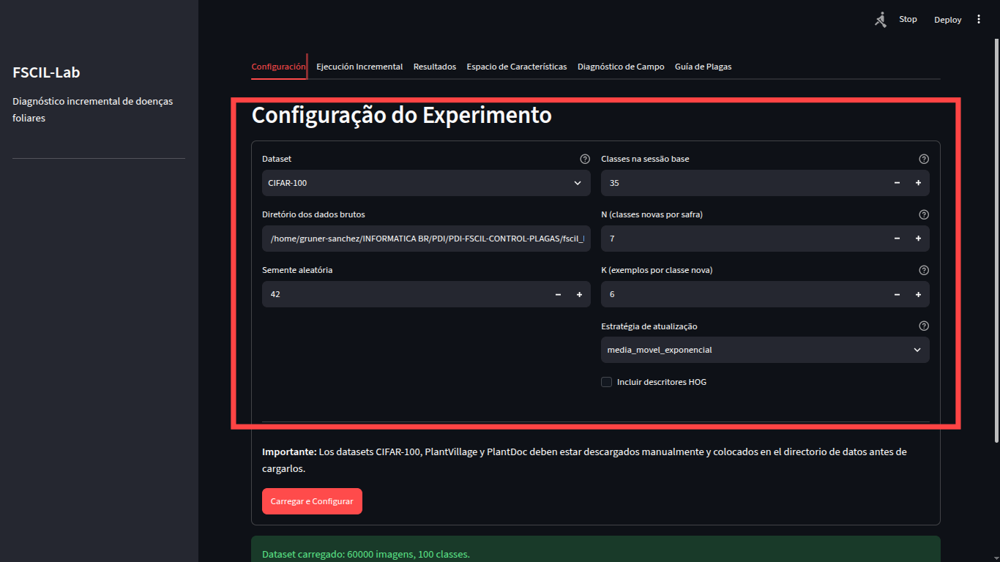

# FSCIL-Lab — Diagnóstico Fitossanitário Incremental

**Few-Shot Class Incremental Learning para classificação de doenças foliares em cultivos agrícolas.**

Sistema interativo baseado em Streamlit que implementa um pipeline completo de FSCIL (Few-Shot Class Incremental Learning) usando descritores clássicos de imagem (GLCM, momentos de Hu, descritores morfológicos, HOG) e classificação por média de protótipos (Nearest Class Mean). O sistema permite simular a chegada progressiva de novas safras com poucos exemplos, avaliando métricas de esquecimento catastrófico e performance incremental.

---

## Índice

- [Visão Geral](#visão-geral)
- [Arquitetura](#arquitetura)
- [Tecnologias e Bibliotecas](#tecnologias-e-bibliotecas)
- [Algoritmos](#algoritmos)
- [Estrutura do Projeto](#estrutura-do-projeto)
- [Instalação](#instalação)
- [Download dos Datasets](#download-dos-datasets)
- [Manual de Uso](#manual-de-uso)
  - [1. Configuração do Experimento](#1-configuração-do-experimento)
  - [2. Execução Incremental (Safras)](#2-execução-incremental-safras)
  - [3. Resultados e Métricas](#3-resultados-e-métricas)
  - [4. Espaço de Características](#4-espaço-de-características)
  - [5. Diagnóstico de Campo](#5-diagnóstico-de-campo)
  - [6. Guia de Plagas](#6-guia-de-plagas)
- [Métricas de Avaliação](#métricas-de-avaliação)
- [Referências](#referências)

---

## Visão Geral

O FSCIL-Lab simula um cenário agrícola real onde novas doenças e pragas surgem safra após safra, e o sistema precisa incorporá-las sem esquecer as já aprendidas (evitando *catastrophic forgetting*). O sistema:

1. Carrega datasets de folhas (PlantVillage, PlantDoc, CIFAR-100 ou sintético)
2. Divide as classes em sessão base + sessões incrementais (simulando safras)
3. Pré-processa as imagens (redimensionamento, normalização, segmentação Sauvola)
4. Extrai descritores clássicos de imagem (GLCM, momentos de Hu, morfologia, HOG)
5. Mantém uma memória de protótipos (centróides por classe) que cresce incrementalmente
6. Avalia acurácia, Performance Dropping Rate e Esquecimento Médio a cada sessão
7. Permite diagnóstico de novas imagens por upload e visualização do espaço de características (PCA)

---

## Arquitetura

```
                    ┌─────────────────────┐
                    │   Streamlit UI      │
                    │   (6 abas)          │
                    └──────────┬──────────┘
                               │
                    ┌──────────▼──────────┐
                    │ GerenciadorDeSessoes│
                    │  (Orquestrador)     │
                    └──┬────┬──────┬────┬─┘
                       │    │      │    │
              ┌────────▼┐ ┌─▼───┐ ┌▼───┐ ┌▼────────┐
              │Dataset  │ │Pré- │ │Ext │ │Memória  │
              │Loader   │ │proc │ │de  │ │de Proto-│
              │         │ │     │ │Feat│ │tipos    │
              └─────────┘ └─────┘ └────┘ └─────────┘
                                            │
                                    ┌───────▼───────┐
                                    │   Métricas    │
                                    │ (Ac, PD, For.)│
                                    └───────────────┘
```

**Fluxo de dados por sessão:**

```
Imagens RGB
    │
    ▼
┌─────────────────────┐
│  Redimensionar      │  (64×64)
│  RGB → Cinza        │  (média ponderada)
│  Normalizar         │  (min-max por imagem)
│  Sauvola            │  (segmentação adaptativa)
└──────────┬──────────┘
           ▼
┌─────────────────────┐
│  GLCM               │  (contraste, homog., energia, correl., ASM)
│  Momentos de Hu     │  (7 momentos invariantes)
│  Morfologia         │  (área, perímetro, excentricidade, solidez)
│  HOG (opcional)     │  (9 orientations, 8×8 cells)
│  StandardScaler     │  (padronização)
└──────────┬──────────┘
           ▼
┌─────────────────────┐
│  Memória de         │
│  Protótipos (NCM)   │
│  • adicionar_classes │
│  • atualizar (EMA)  │
│  • recalibrar       │
│  • classificar      │
└──────────┬──────────┘
           ▼
┌─────────────────────┐
│  Métricas           │
│  • Acurácia         │
│  • Matriz Confusão  │
│  • PD Rate          │
│  • Forgetting       │
└─────────────────────┘
```

---

## Tecnologias e Bibliotecas

| Tecnologia       | Versão | Função                                          |
|------------------|--------|--------------------------------------------------|
| Python           | ≥3.10  | Linguagem base                                   |
| Streamlit        | ≥1.28  | Interface web interativa                         |
| NumPy            | ≥1.24  | Manipulação numérica e vetorização               |
| scikit-image     | ≥0.21  | Processamento de imagens (GLCM, HOG, Sauvola)    |
| scikit-learn     | ≥1.3   | StandardScaler, PCA, métricas                    |
| OpenCV (via sck) | —      | Leitura de imagens                               |
| pandas           | ≥2.0   | Tabelas e agregação de dados                     |
| matplotlib       | ≥3.7   | Gráficos e visualizações                         |
| SciPy            | ≥1.11  | Distância euclidiana vetorizada (cdist)          |
| huggingface-hub  | —      | Download de datasets via Hugging Face (opcional) |

---

## Algoritmos

### 1. Pré-processamento (`src/preprocessing.py`)

- **Redimensionamento:** `skimage.transform.resize` com `preserve_range=True` para (64×64)
- **Escala de cinza:** Combinação linear RGB→Y (luminância) imagem a imagem via `rgb2gray`
- **Normalização min-max:** Vetorizada com broadcasting, evita divisão por zero
- **Segmentação Sauvola:** Limiarização adaptativa local (janela 25×25) para obter máscaras binárias das folhas

### 2. Extração de Características (`src/feature_extraction.py`)

- **GLCM** (Gray-Level Co-occurrence Matrix):
  - Distâncias: [1, 3, 5] pixels
  - Ângulos: [0°, 45°, 90°, 135°]
  - Propriedades: contraste, homogeneidade, energia, correlação, ASM
  - Agregado por média entre distâncias/ângulos → vetor 5D

- **Momentos de Hu:**
  - 7 momentos invariantes a translação, escala e rotação
  - Log-transformados para estabilidade numérica
  - Vetor 7D

- **Descritores Morfológicos:**
  - Área, perímetro, excentricidade, solidez
  - Seleciona o maior objeto binário (região de interesse)
  - Vetor 4D

- **HOG** (Histogram of Oriented Gradients):
  - 9 orientações, células 8×8, blocos 2×2
  - Vetor 1764D para 64×64 (configurável)
  - Opcional (ativável na interface)

- **Padronização:** `StandardScaler` (média 0, desvio 1) ajustado na sessão base e reutilizado nas sessões seguintes

### 3. Memória de Protótipos (`src/prototype_memory.py`)

**Nearest Class Mean (NCM):**

```
Protótipo_c = μ_c = (1/N_c) * Σ f_i   para todo i em classe c
```

- Classificação por distância euclidiana mínima ao protótipo mais próximo
- Três estratégias de atualização de protótipos existentes:
  - **Média simples:** apenas adiciona novas classes, não altera protótipos antigos
  - **Média móvel exponencial:** `P_novo = α * P_antigo + (1-α) * μ_novo`
  - **Recalibração por contagem:** ponderação pelo número de amostras vistas historicamente

### 4. Métricas (`src/metrics.py`)

- **Acurácia:** `mean(verdadeiros == preditos)`
- **Performance Dropping (PD):** `ac_base - ac_ultima_sessao`
- **Esquecimento Médio (Forgetting):** `mean(pico_historico - valor_final)` por classe

---

## Estrutura do Projeto

```
PDI-FSCIL-CONTROL-PLAGAS/
├── README.md                          # Este documento
├── fscil_lab/
│   ├── app.py                         # Interface Streamlit (6 abas)
│   ├── requirements.txt               # Dependências Python
│   ├── download_datasets.sh           # Script de download dos datasets
│   ├── organize_datasets.sh           # Script para organizar a estrutura dos datasets
│   ├── data/
│   │   ├── raw/                       # Datasets brutos (gitignored)
│   │   │   ├── cifar100/              # CIFAR-100 (meta, train, test)
│   │   │   ├── plantvillage/color/    # PlantVillage (subpastas por classe)
│   │   │   └── plantdoc/              # PlantDoc (subpastas por classe)
│   │   └── sessions/                  # Cache de sessões (gitignored)
│   ├── src/
│   │   ├── __init__.py
│   │   ├── dataset_loader.py          # Carga de datasets (sintético, CIFAR-100, PlantVillage, PlantDoc)
│   │   ├── preprocessing.py           # Pipeline de pré-processamento
│   │   ├── feature_extraction.py      # Extração de características (GLCM, Hu, morfologia, HOG)
│   │   ├── prototype_memory.py        # Memória de protótipos (NCM)
│   │   ├── session_manager.py         # Orquestração FSCIL
│   │   ├── metrics.py                 # Métricas de avaliação
│   │   ├── utils.py                   # Utilitários (encoder JSON)
│   │   └── pest_guide.py              # Guia fitossanitária de referência
│   ├── tests/
│   │   ├── __init__.py
│   │   └── test_pipeline.py           # Testes unitários
│   └── notebooks/
│       └── validacao_pipeline.ipynb   # Notebook de validação
└── docs/
    └── screenshots/                   # Capturas de tela para o manual
```

---

## Instalação

```bash
# 1. Clonar o repositório
git clone https://github.com/seu-usuario/PDI-FSCIL-CONTROL-PLAGAS.git
cd PDI-FSCIL-CONTROL-PLAGAS

# 2. Criar ambiente virtual
python3 -m venv .venv
source .venv/bin/activate

# 3. Instalar dependências
pip install --upgrade pip
pip install -r fscil_lab/requirements.txt
```

> **Nota:** O arquivo `fscil_lab/.venv.zip` contém um ambiente virtual pré-configurado. Descompacte com `unzip fscil_lab/.venv.zip -d fscil_lab/` se preferir.

---

## Download dos Datasets

### 1. Download automático

Execute o script incluso:

```bash
./fscil_lab/download_datasets.sh
```

O script baixa automaticamente:

| Dataset       | Tamanho | Fonte                       | Método de descarga                          |
|---------------|---------|-----------------------------|---------------------------------------------|
| CIFAR-100     | ~170 MB | CS Toronto / Hugging Face   | `aria2c` (multi-thread) → `axel` → `wget`   |
| PlantVillage  | ~800 MB | Hugging Face (recomendado)  | `snapshot_download` via `huggingface-hub`    |
| PlantDoc      | ~150 MB | GitHub                      | `wget` + `unzip`                            |

### 2. Organizar estrutura

Após o download, execute o script de organização para garantir que as pastas fiquem na estrutura esperada pelo código:

```bash
./fscil_lab/organize_datasets.sh
```

Este script:
- **PlantVillage**: move `plantvillage dataset/color/` → `color/` (corrige estrutura do Hugging Face)
- **PlantDoc**: mescla `train/` + `test/` em pastas de classe na raiz de `plantdoc/`
- **CIFAR-100**: já fica na estrutura correta

### 3. Estrutura final esperada

```
fscil_lab/data/raw/
├── cifar100/
│   ├── meta
│   ├── train
│   └── test
├── plantvillage/
│   └── color/
│       ├── Apple___Apple_scab/
│       ├── Apple___Black_rot/
│       ├── Tomato___Late_blight/
│       └── ...
└── plantdoc/
    ├── Apple Scab Leaf/
    ├── Tomato leaf/
    └── ...
```

> O dataset **Sintético** não precisa de download — basta selecioná-lo na interface.

### 4. Download manual alternativo

Se os scripts automáticos falharem devido à velocidade de conexão, os links diretos são:

- **CIFAR-100:** `https://www.cs.toronto.edu/~kriz/cifar-100-python.tar.gz`
- **PlantVillage:** `https://huggingface.co/datasets/mohanty/PlantVillage` (via `load_dataset("mohanty/PlantVillage", "color")`)
- **PlantDoc:** `https://github.com/pratikkayal/PlantDoc-Dataset/archive/refs/heads/master.zip`

### 5. Instalar descargadores multi-thread (opcional, acelera CIFAR-100)

```bash
sudo apt install aria2   # Debian/Ubuntu
# ou
sudo pacman -S aria2     # Arch Linux
```

---

## Manual de Uso

Execute a aplicação:

```bash
streamlit run fscil_lab/app.py
```

A interface possui 6 abas. Abaixo o passo a passo de cada uma.

---

### 1. Configuração do Experimento



Nesta aba você define os parâmetros do experimento FSCIL:

1. **Dataset:** Selecione entre Sintético (gera dados aleatórios), CIFAR-100, PlantVillage ou PlantDoc
2. **Diretório dos dados brutos:** Caminho para a pasta com os datasets baixados (padrão: `data/raw`)
3. **Semente aleatória:** Para reproducibilidade (padrão: 42)
4. **Classes na sessão base:** Quantas classes diferentes compõem a primeira sessão
5. **N (classes novas por safra):** N-way — quantas novas doenças surgem em cada sessão incremental
6. **K (exemplos por classe nova):** K-shot — quantas imagens de treino por nova classe
7. **Estratégia de atualização:** Como ajustar protótipos existentes ao incorporar novas classes:
   - *Média simples:* não altera protótipos antigos
   - *Média móvel exponencial:* suavização exponencial dos protótipos
   - *Recalibração por contagem:* ponderação pelo histórico de amostras
8. **Incluir descritores HOG:** Ativa extração HOG (aumenta dimensionalidade)

Clique em **"Carregar e Configurar"**. O sistema carregará o dataset, dividirá as sessões e executará a sessão base.

---

### 2. Execução Incremental (Safras)

> **Captura:** `docs/screenshots/tab_exec.png` *(pendiente)*

Após configurar, vá para esta aba para simular a chegada de novas safras:

1. O sistema mostra as **novas doenças/plagas** desta safra com informações da guia fitossanitária
2. É possível **ver exemplos** das novas classes (expanda "Ver imágenes de ejemplo")
3. Ajuste **K** (quantidade de exemplos) para esta sessão específica
4. Clique em **"Simular chegada da safra N"**

A cada sessão:
- As novas classes são adicionadas à memória de protótipos
- A acurácia é avaliada sobre **todas as classes vistas até o momento**
- A curva de acurácia é atualizada em tempo real

Continue clicando até que todas as safras sejam processadas.

---

### 3. Resultados e Métricas

> **Captura:** `docs/screenshots/tab_results.png` *(pendiente)*

Após executar as sessões, visualize:

- **Acurácia Média:** Across todas as sessões
- **Performance Dropping Rate:** Diferença entre primeira e última sessão (quanto maior, pior o esquecimento)
- **Esquecimento Médio:** Queda média de acurácia por classe do pico ao valor final
- **Curva de Acurácia por Sessão:** Gráfico interativo
- **Matriz de Confusão:** Da última sessão
- **Tabela de classes** disponíveis na memória
- **Exportação de resultados:**
  - **CSV:** Precisão por sessão (para Excel/Google Sheets)
  - **JSON completo:** Inclui acurácias, PD rate, forgetting, matrizes de confusão e histórico por classe — ideal para análise externa com Python/R/Matlab

---

### 4. Espaço de Características

> **Captura:** `docs/screenshots/tab_espaco.png` *(pendiente)*

Visualização PCA 2D das características extraídas:
- Cada ponto é uma imagem projetada nos 2 primeiros componentes principais
- Cores distintas representam classes diferentes
- "X" vermelhos são os protótipos (centróides) de cada classe
- Útil para avaliar separabilidade e identificar confusões entre classes

---

### 5. Diagnóstico de Campo

> **Captura:** `docs/screenshots/tab_demo.png` *(pendiente)*

Funcionalidade de inferência para novas imagens:

1. Faça **upload** de uma foto de folha (PNG, JPG, BMP, TIFF)
2. O sistema extrai as características e compara com todos os protótipos conhecidos
3. Resultado:
   - **Diagnóstico:** classe predita (nome comum e cultivo)
   - **Confiança:** `1 / (1 + distância_euclidiana)`
   - **Tipo:** doença, praga ou sadio
   - **Top-3** classes mais próximas com distâncias
   - Detalhes do agente causal, sintomas e tratamento sugerido
4. Se a confiança for muito baixa (< 0.3), o sistema sugere registrar como nova classe

---

### 6. Guia de Plagas

> **Captura:** `docs/screenshots/tab_guia.png` *(pendiente)*

Base de dados de referência com informações de todas as classes do PlantVillage:

- **Por cultivo:** Agrupado por tipo de planta (manzano, tomate, papa, etc.)
- **Por tipo:** Enfermedad, plaga ou sano
- **Tabla completa:** Visualização tabular com todas as classes
- Cada entrada inclui: nome comum, cultivo, agente causal, sintomas e tratamento sugerido

---

## Métricas de Avaliação

### Performance Dropping Rate (PD)

Métrica principal para quantificar o esquecimento catastrófico:

```
PD = Acurácia(sessão_base) - Acurácia(última_sessão)
```

- **PD = 0:** Sem esquecimento (ideal)
- **PD > 0:** Houve degradação na performance
- **PD < 0:** O sistema melhorou com novas classes (raro, mas possível)

### Esquecimento Médio (Average Forgetting)

Calcula a queda de acurácia por classe individualmente:

```
Forgetting_c = max_acerto_historico(c) - acerto_final(c)
Forgetting_médio = mean(Forgetting_c)  para todas as classes c
```

- Mede o quanto cada classe esquece individualmente
- Complementa o PD que é uma métrica global

### Matriz de Confusão

Matriz normalizada (por linha) mostrando acertos e erros entre todas as classes vistas. Útil para identificar quais pares de classes são mais confundidos.

---

## Referências

### Artigos Científicos

1. **FSCIL Foundations:** Rebuffi, S. A., Kolesnikov, A., Sperl, G., & Lampert, C. H. (2017). *iCaRL: Incremental Classifier and Representation Learning*. CVPR.
2. **Prototype-based FSCIL:** Snell, J., Swersky, K., & Zemel, R. (2017). *Prototypical Networks for Few-shot Learning*. NeurIPS.
3. **Nearest Class Mean:** Mensink, T., Verbeek, J., Perronnin, F., & Csurka, G. (2013). *Distance-Based Image Classification: Generalizing to New Classes at Near-Zero Cost*. TPAMI.
4. **Catastrophic Forgetting:** McCloskey, M., & Cohen, N. J. (1989). *Catastrophic Interference in Connectionist Networks: The Sequential Learning Problem*. Psychology of Learning and Motivation.

### Datasets

5. **PlantVillage:** Mohanty, S. P., Hughes, D. P., & Salathé, M. (2016). *Using Deep Learning for Image-Based Plant Disease Detection*. Frontiers in Plant Science. [Link](https://github.com/spMohanty/PlantVillage-Dataset)
6. **PlantDoc:** Singh, D., Jain, N., Jain, P., Kayal, P., Kumawat, S., & Batra, N. (2020). *PlantDoc: A Dataset for Visual Plant Disease Detection*. CODS-COMAD. [Link](https://github.com/pratikkayal/PlantDoc-Dataset)
7. **CIFAR-100:** Krizhevsky, A. (2009). *Learning Multiple Layers of Features from Tiny Images*. [Link](https://www.cs.toronto.edu/~kriz/cifar.html)

### Bibliotecas

8. Streamlit — [https://streamlit.io](https://streamlit.io)
9. scikit-image — [https://scikit-image.org](https://scikit-image.org)
10. scikit-learn — [https://scikit-learn.org](https://scikit-learn.org)
11. NumPy — [https://numpy.org](https://numpy.org)

### Técnicas de Processamento de Imagens

12. **GLCM:** Haralick, R. M., Shanmugam, K., & Dinstein, I. (1973). *Textural Features for Image Classification*. IEEE Transactions on Systems, Man, and Cybernetics.
13. **Momentos de Hu:** Hu, M. K. (1962). *Visual Pattern Recognition by Moment Invariants*. IRE Transactions on Information Theory.
14. **HOG:** Dalal, N., & Triggs, B. (2005). *Histograms of Oriented Gradients for Human Detection*. CVPR.
15. **Sauvola Thresholding:** Sauvola, J., & Pietikäinen, M. (2000). *Adaptive Document Image Binarization*. Pattern Recognition.

---

## Licença

Este projeto foi desenvolvido como trabalho acadêmico para a disciplina de **Processamento Digital de Imagens (PDI)**.

---

*Documentação gerada em Julho de 2026.*
